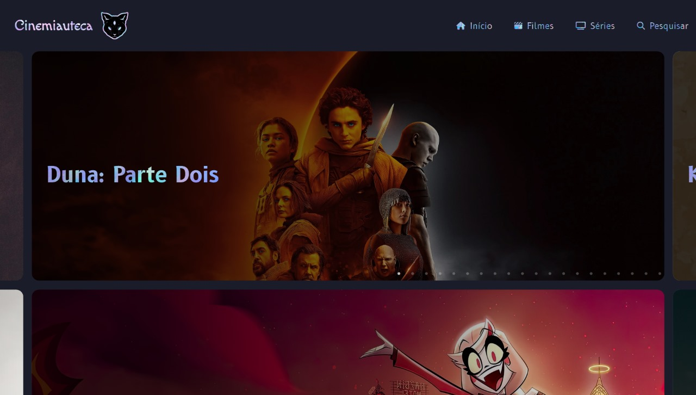

# Cinemiauteca 🎬🍿

> Status : Finished project ✅ / Open PR

## Personal project with pair programming

*Technologies*

+ ReactJS ⚛️
+ Styled-components 💅
+ Disqus 🗨️
+ React-router-dom 🌐

### How to use
 
- git clone https://github.com/skyvieira/cinemiauteca.git or download the zip
- npm install or yarn install
- code . (if you use VSCode)
- npm start or yarn start
 
 ## 💻 Online Page: https://cinemiauteca.bohr.io

## 🌐 Contact us:
 Sky Vieira

 Gustavo Almeida
